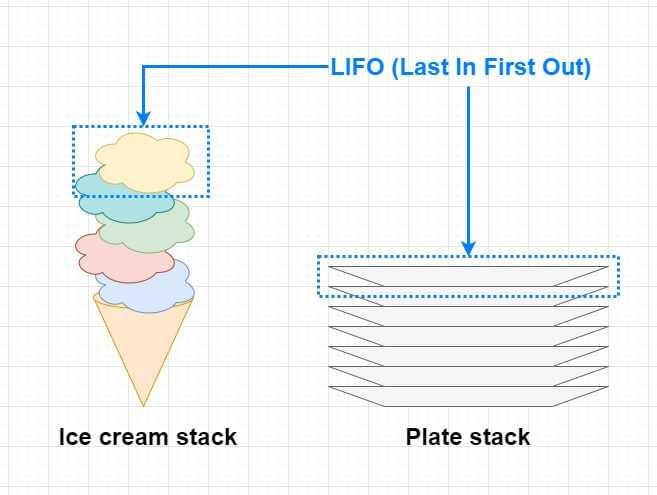

# Call Stack And Web API

  To Understand Ajax, Fetch, Promises


## Table of Content
- [Call Stack - Stack Trace](#call-stack---stack-trace) 
- [Web API](#web-api) 
 
## Call Stack - Stack Trace
- --> JavaScript Engine Uses A Call Stack To Manage Execution Contexts
- --> Mechanism To Make The Interpreter Track Your Calls
- --> When Function Called It Added To The Stack
- --> When Function Executed It Removed From The Stack
- --> After Function Is Finished Executing The Interpreter Continue From The Last Point
- --> Work Using LIFO Principle => Last In First Out
- --> Code Execution Is Synchronous.
- --> Call Stack Detect Web API Methods And Leave It To The Browser To Handle It




```js

function one() {
  console.log("One");
}
function two() {
  one();
  console.log("Two");
}
function three() {
  two();
  console.log("Three");
}

three();

/*
================================= last in first out
console.log("One");
================================= befire last in second out
function one() {
  console.log("One");
}
================================= second in befor last out
function two() {
  one();
  console.log("Two");
}
================================= first in last out
function three() {
  two();
  console.log("Three");
}
=================================
*/

console.log("#####");
console.log("One");
console.log("Two");
console.log("Three");
```
## Web API
-> Methods Available From The Environment => Browser
```js
setTimeout(() => {
  console.log("Web API");
}, 0);
```
-> if we add this mehod here to the top of this file and excute all the code it's well be the last one exucte. why ?
because it's web API, and browser run web API methods after done with methods.

-> in other word browser runs web APIs methods after call stack going empty

Happy Coding!
